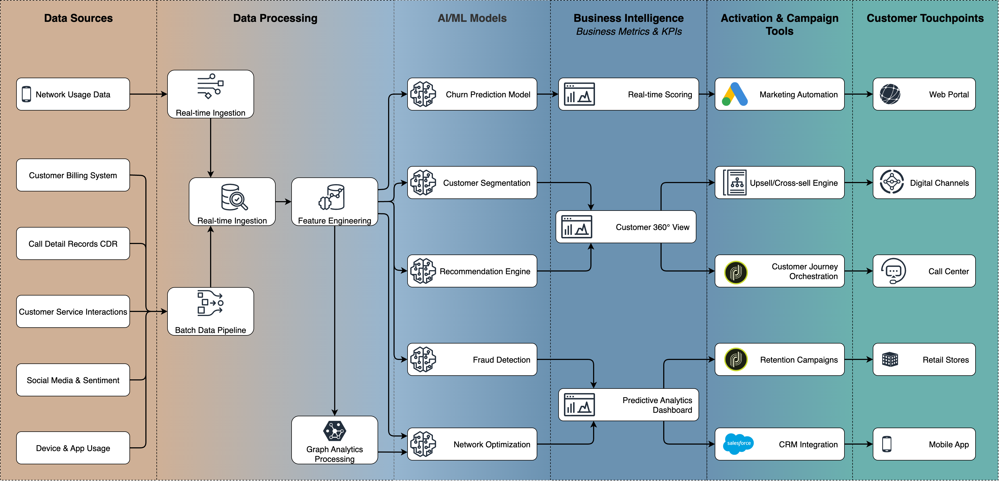
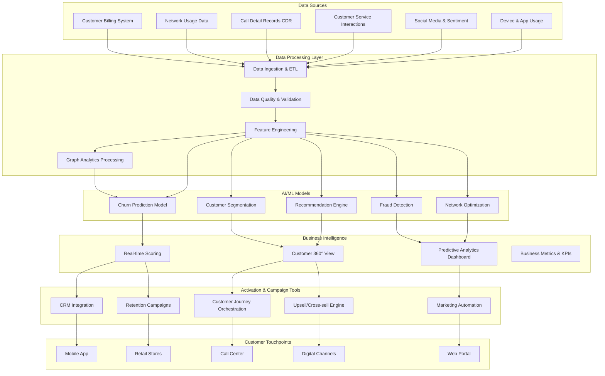
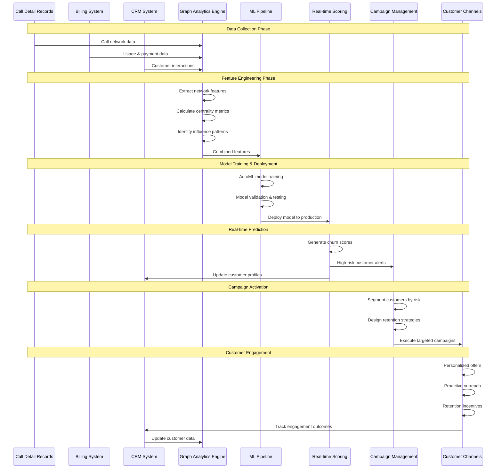

# Telco-Retail AI Demos

A comprehensive collection of applied AI use cases specifically designed for the telecom retail industry. This repository contains ready-to-use demos and implementations for critical business challenges faced by telecom operators, including customer churn prediction, referral-based growth engines, customer segmentation, and more.

These demos are built using state-of-the-art machine learning and predictive analytics techniques to help telecom operators:

- **Retain customers** through proactive churn detection and prevention
- **Drive acquisition** via intelligent referral systems and targeted marketing
- **Optimize operations** with data-driven insights and automated decision-making
- **Enhance customer experience** through personalized recommendations and services

## System Architecture

## End-to-End Churn Prediction Workflow

## Telco Retail Sector Tooling & Integrations

### Campaign Management Tools

- **Salesforce Marketing Cloud** - Multi-channel campaign orchestration
- **Adobe Campaign** - Customer journey management
- **HubSpot** - Marketing automation and lead scoring
- **Pardot** - B2B marketing automation

### Customer Experience Platforms

- **Zendesk** - Customer service and support
- **Intercom** - Real-time customer messaging
- **Freshdesk** - Help desk and ticketing
- **Zoho CRM** - Customer relationship management

### Analytics & Business Intelligence

- **Tableau** - Data visualization and dashboards
- **Power BI** - Microsoft's business analytics
- **Looker** - Data exploration and insights
- **Google Analytics** - Web and app analytics

### Real-time Processing

- **Apache Kafka** - Event streaming platform
- **Apache Spark Streaming** - Real-time data processing
- **Redis** - In-memory data store for caching
- **Elasticsearch** - Search and analytics engine

### Telecom-Specific Tools

- **Amdocs** - BSS/OSS systems
- **Ericsson** - Network management
- **Huawei** - Telecom infrastructure
- **Nokia** - Network solutions

## Project Structure

This repository is organized into focused subdirectories, each containing a specific AI use case implementation:

- **[churn-prediction](./churn-prediction/README.md)** - Customer churn prediction models and analysis tools
- **[referral-engine](./referral-engine/)** - Referral-based growth engine and customer acquisition system
- **[customer-segmentation](./customer-segmentation/)** - Customer segmentation and clustering algorithms
- **[predictive-analytics](./predictive-analytics/)** - Advanced predictive analytics for business intelligence
- **[recommendation-engine](./recommendation-engine/)** - Product and service recommendation systems
- **[fraud-detection](./fraud-detection/)** - Fraud detection and prevention mechanisms
- **[network-optimization](./network-optimization/)** - Network performance optimization and predictive maintenance
- **[customer-sentiment](./customer-sentiment/)** - Customer sentiment analysis and feedback processing

Each subdirectory contains complete implementations with documentation, sample data, and deployment instructions.
