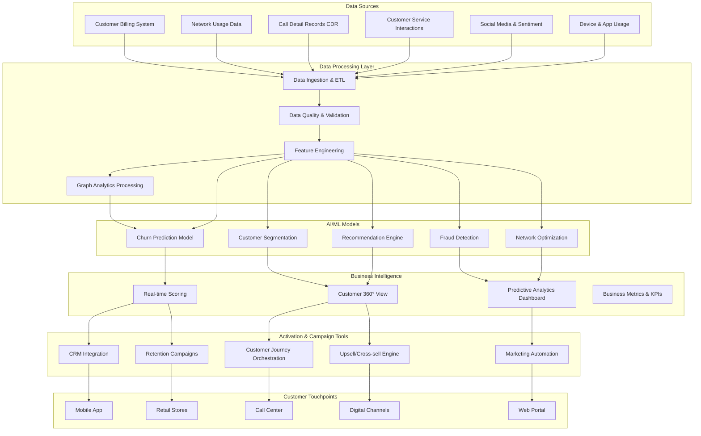
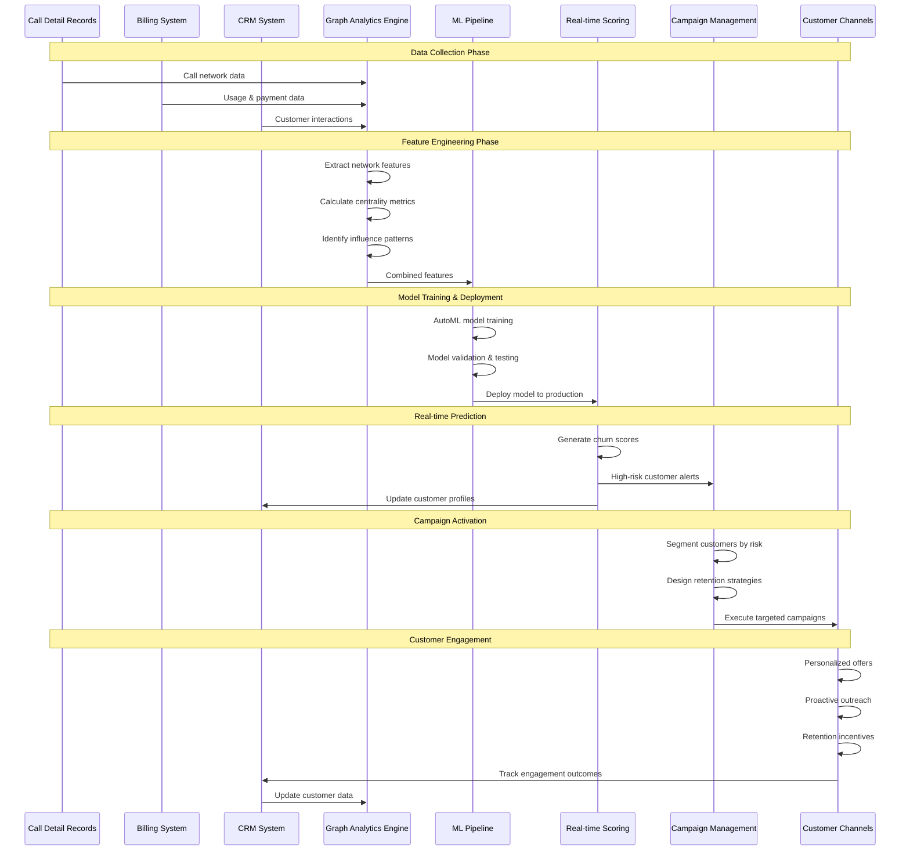

## Graph analytics for telco customer churn prediction

Graph analytics is a field of data analysis that focuses on extracting insights from data represented as graphs. A graph is a mathematical representation of a network of interconnected objects, where the objects are represented as nodes, and the connections between them are represented as edges.

Features extracted from telco customer network can provide valuable insights into the relationships and patterns of behavior among customers. Customer relationship data can be represented as a graph, where nodes represent customers and edges represent phone calls between customers.

By analyzing the call network graph features, machine learning models can identify patterns and predict which customers are most likely to churn. For example, machine learning models can analyze the network structure to identify customers who are more central or connected in the network, indicating that they may have a greater influence on other customers' behavior. Additionally, machine learning models can analyze the patterns of calls between customers, such as the frequency and duration of calls.

By combining these features with other customer data, such as demographics and usage patterns, machine learning models can build more accurate models for predicting customer churn. This can enable telecom companies to take proactive steps to retain customers and improve the customer experience, ultimately leading to increased customer loyalty and profitability.

---

## Workflow Of Churn Prediction

## End-to-End Churn Prediction Workflow

---

## Requirements

| library | description        | license | source                         |
| ------- | ------------------ | ------- | ------------------------------ |
| PyYAML  | Reading Yaml files | MIT     | https://github.com/yaml/pyyaml |

## Project support

Any issues discovered through the use of this project should be filed as GitHub Issues on the Repo. They will be reviewed as time permits.
